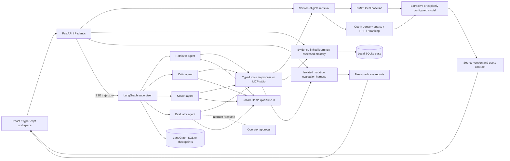

# EvidenceForge

**Engineering knowledge, research evidence, and skill building in one workspace.**

PROJ-03 from `MASTER_PLAN_Shreyansh.xlsx`, expanded beyond a RAG chatbot.
Ask about engineering decisions, compare AI research, then work through an
evidence-linked learning path whose progress comes from assessments rather than
a personality label.

This is a **local-first prototype**, not a finished production system or a
50,000-document benchmark. The interface reports the actual corpus and evaluation
counts. Starter sources are original educational summaries and controlled
fixtures with links to primary material, not imported full papers.

## What makes the project worth building

Most static answer scoring cannot tell you whether a system reacts correctly
when its evidence changes. EvidenceForge makes that behavior executable:

| Change | Expected behavior |
| --- | --- |
| A document gets a new version | Use the eligible version; do not cite future evidence for an older as-of date. |
| Supporting evidence disappears | Abstain when support is gone rather than preserve a stale answer. |
| Curated assertions conflict | Surface the conflict instead of silently selecting a convenient source. |
| Untrusted source text contains instructions | Treat it as data; exercise injection probes without executing it. |
| Learning evidence changes | Detect that a saved learning plan is stale and rebuild it from current evidence. |
| A learner changes MBTI preferences | Presentation can change; their assessed mastery cannot. |

These are engineering hypotheses tested by the harness, **not a claim of a
world-first algorithm**. Corrective RAG, contextual retrieval, uncertainty
estimation and CI evaluation all have existing prior art.

## Run locally

Prerequisites: Python 3.12+, [uv](https://docs.astral.sh/uv/), Node.js compatible
with the frontend package's engine requirement, and npm. Docker is not required
for the default mode.

```bash
cd proj-03-evidence-forge
make setup
```

Start the API and interface in separate terminals:

```bash
make api
```

```bash
make web
```

Open **http://127.0.0.1:5178**. API documentation is at
http://127.0.0.1:8033/docs. The frontend proxies `/api` to the local API; no
cross-origin wildcard is required.

The default runtime uses **BM25 retrieval and extractive answers**. It is
deliberately not advertised as a neural model. It needs no paid API, external
model call, or model download. State persists in `backend/.data` by default.
Use `EVIDENCEFORGE_DATA_DIR` to select a different location.

Optional settings are documented in `.env.example`. They are not loaded
implicitly: copy that file to `.env`, edit it, and run from `backend/`:

```bash
uv run --env-file ../.env uvicorn evidenceforge.api:app --host 127.0.0.1 --port 8033
```

### Run on Windows

The same targets exist as `ef.cmd <command>` (a PowerShell 5.1-compatible runner,
no execution-policy change needed). After installing `uv`, Node.js LTS and
Ollama with winget:

```bat
ef.cmd doctor     :: preflight: tools, ports, Ollama, model
ef.cmd setup      :: uv sync --locked + npm ci
ef.cmd test       :: offline test suites
ef.cmd dev        :: API and web in two windows
```

`docs/WINDOWS.md` has the full walkthrough, expected timings and a
troubleshooting table. `make doctor` runs the same preflight on macOS/Linux.

### Shipping the folder

`make ship` (or `ef.cmd ship`) writes `docs/SHIP_MANIFEST.sha256` and a zip next
to the project directory containing a single top-level folder with source,
lockfiles and docs only — no `.venv`, `node_modules`, `.data`, `dist` or `.env`.
On the destination run `ef.cmd doctor -VerifyManifest` (or
`python3 scripts/doctor.py --verify-manifest`) to confirm every file arrived
intact, then `setup`. `AGENTS.md` and `docs/HANDOFF.md` orient the next person
or AI agent. `docs/poster/` holds the repo social-preview image, and
`docs/INTERVIEW_PREP.md` / `docs/LINKEDIN_POST.md` are the talk-track and
announcement drafts, with every number tied to `docs/HANDOFF.md`.

Never commit `.env`, learner state, model caches, private corpora or credentials.
This prototype is **single-user and loopback-only**. Do not expose it publicly
without authentication, authorization, rate limits and deployment hardening.

## The workspace

**Agents** hands a goal to a LangGraph supervisor that coordinates four
specialist agents (retriever, critic, learning coach, evaluator) with real tool
calls against a local Ollama model. The trajectory streams live: plan, handoffs,
every tool call and result, specialist reports, warnings and the final
synthesized answer. The evaluator's only write action pauses at a
human-in-the-loop checkpoint until you approve or decline it. See
[Multi-agent layer](#multi-agent-layer) for what is and is not enforced by code.

**Ask** retrieves engineering or research evidence with an as-of date, exact
source-version citations and an execution trace. Unavailable retrieval modes are
disabled rather than silently replaced.

**Research** compares selected research summaries and keeps the supporting
sources visible. The offline output is extractive, not an autonomous literature
review or a guarantee that the selected papers agree.
The picker uses version-availability and withdrawal metadata, not publication
date alone, and does not resurrect an older version after a newer one is removed.

**Skill builder** uses a stated goal, experience, time budget, editable
presentation preferences and server-graded assessments. The starter curriculum
is scoped to RAG/research engineering; arbitrary goals do not magically produce
a validated course. Repeating one quiz must not inflate mastery.

**Eval lab** executes isolated source-mutation scenarios and displays their real
results. It does not modify the learner's live corpus or progress to run a test.
Exact citation/quote validity is a structural metric, **not semantic
faithfulness**. Unavailable judge-based metrics are shown as unavailable.

## Personality is a preference, not a verdict

All 16 MBTI-style labels are optional. A label may suggest an explanation tone or
activity format, and those settings remain independently editable. The app does
not infer a personality type, diagnose a learner, estimate ability from a type,
or treat MBTI as a validated learning-style assessment.

Selecting a label alone changes nothing. The explicit **Apply starter preferences**
button copies a visible interface preset into the editable tone/activity fields.
This app's template maps T/F to concise/supportive and N/S to concept/build-first;
that mapping is a design choice, not an established educational effect.

Mastery comes from submitted assessment responses. Difficulty and prerequisites
must not be controlled by MBTI. Quiz progress alone is not evidence of long-term
learning effectiveness; that requires held-out transfer tasks and delayed
retention measurements.

## Architecture

| Layer | Selected implementation |
| --- | --- |
| Interface | React 19.3, TypeScript 7.0, Vite 8.3 |
| API and contracts | FastAPI 0.141, Pydantic 2.13 |
| Bounded execution | LangGraph 1.2 (query pipeline and the multi-agent supervisor graph) |
| Specialist agents | LangChain 1.4 `create_agent` tool loops + provider-native JSON-schema reports |
| Local model runtime | Ollama with `qwen3.5:9b` through `langchain-ollama` (loopback only, never downloaded by the app) |
| Tool protocol | Official `mcp` SDK server over stdio; `langchain-mcp-adapters` client path |
| Agent state | `langgraph-checkpoint-sqlite` checkpoints, `interrupt()`/resume human-in-the-loop gate |
| Default retrieval | Offline BM25, title/tag contextual variant, bounded lexical correction |
| Opt-in neural retrieval | Qdrant client 1.19, FastEmbed 0.8, dense/sparse RRF and cross-encoder reranking |
| Generation | Extractive baseline or an explicitly configured OpenAI-compatible endpoint |
| State and evaluation | SQLite, isolated mutation scenarios, trajectory-level agent evals, JSON reports and a fail-closed CLI gate |

Exact resolved versions are pinned in the package manifests and lockfiles.
The offline contextual and corrective variants are transparent lexical
baselines, not substitutes for LLM-generated contextual embeddings or a trained
CRAG implementation. The current harness forces extractive generation to remain
offline, even if interactive answers use an optional model.



Use the current stable ecosystem where it earns its complexity: typed APIs,
Qdrant hybrid retrieval, bounded orchestration, explicit model adapters and
reproducible evaluations. Adding every AI framework is not an architectural
goal. MCP and multi-agent execution are included because they are exercised by
trajectory-level evaluations, not because the names appear in the dependency
file. GraphRAG and multimodal retrieval remain separate future experiments.

## Multi-agent layer

The **Agents** tab is a real supervisor/specialist system, not a renamed
pipeline. What each layer does and which guarantees are enforced by code:

| Piece | Implementation | Enforced by code, not by prompt |
| --- | --- | --- |
| Planner | One structured-output call produces `Plan{intent, steps, question}` | Steps validated against the specialist allowlist; invalid plans fall back to a deterministic default per intent. Any `retriever` step gets a `critic`, and the specialist a goal requires (`evaluator` for a goal that names the mutation suite, `coach` for learning) is appended from a **code-derived keyword hint over the user's goal**, never from the model's intent label alone; every repair is a visible `warning` event |
| Supervisor | Deterministic router over typed state returning LangGraph `Command(goto=…)` | Follows the plan in order; at most one `retry_retrieval` loop; hard cap on handoffs plus a graph recursion limit and a wall-clock timeout |
| Retriever | `create_agent` loop over `search_evidence` / `get_source`, then a JSON-schema `EvidenceReport` | Every quoted excerpt is re-checked with `verify_quote`; invalid quotes are dropped and logged as warnings |
| Critic | Loop over `verify_quote` / `get_source`, then `CriticReport` with a verdict | A claim with an invalid quote never reaches the final answer regardless of the model's opinion; `llm_supported` is labelled an uncalibrated judgment |
| Coach | Loop over `get_learner` / `list_skills` / `recommend_next_skill`, then `CoachReport` | The next skill is the deterministic mastery/prerequisite rule; a model override is rejected and recorded; MBTI may change tone words only |
| Evaluator | Loop over `list_eval_cases` / `run_eval_case`, plus the approval-gated `run_mutation_suite` | Pass/fail counts are recomputed from actual tool results; the only write action stops at `interrupt()` until an operator resumes. **After an approved resume, code executes exactly the approved action once** through the audited tool path before the model's turn, so approval guarantees the write regardless of what the model does next; a duplicate attempt is refused with `approved_action_already_executed` |
| Synthesizer | Composes the final answer from critic-approved claims | No new model call; `status` is `answered`, `partial` or `abstained` from the surviving claim set |

Design notes learned on this machine and encoded in the implementation:

- Each specialist receives its **own** message list (system prompt plus one
  brief). Forwarding shared history that ends with an assistant turn makes the
  local model emit an end-of-sequence token and return nothing.
- Specialists are **two-phase**: a tool-calling loop first, then a separate
  provider-native JSON-schema call for the report. Forcing a JSON grammar on the
  same call suppresses tool calls on Ollama.
- Tool results are wrapped as untrusted data and sources that look like
  instructions are quarantined by the existing heuristic screen. That is a
  heuristic, not a complete prompt-injection defense.
- The same tools are exposed as an **MCP server** (`make mcp`, stdio). A parity
  test asserts the MCP tool names and JSON schemas equal the in-process tools,
  and `EVIDENCEFORGE_AGENT_TOOLS=mcp` routes the agents' read tools through
  `langchain-mcp-adapters` instead of direct calls. The single write tool
  (`run_mutation_suite`) is deliberately **not** executable over MCP: the
  standalone server rejects it with the same name and schema, and the agent
  graph always binds the trusted in-process, approval-gated implementation.
  That keeps the human-in-the-loop boundary inside the process that owns the
  checkpoint rather than trusting a transport.
- Two planning slips were observed from the real 9B model during browser
  integration and are now covered by regressions: a goal that named the
  mutation suite planned `intent: evaluate, steps: [retriever]` (the run would
  have abstained without ever reaching the evaluator), and an educational
  question was labelled `intent: evaluate` with correct evidence steps (trusting
  the label would have summoned an unrelated approval prompt). Hence the rule:
  required specialists come from the goal text via code, not from the label.
- The approved write is likewise not left to the model. In one live run the
  evaluator spent its whole step budget on isolated `run_eval_case` calls and
  never invoked the suite the operator had just approved; the answer was
  honest ("3 passed of 3 executed cases") but the approval did nothing. Now the
  graph performs the approved action itself, and the model only summarises.
- Trajectory evals report real counts: seven invariants checked over the run
  IDs the scripted suite actually produces (resumed runs count once), with
  `semantic_faithfulness` and `cost_usd` still `null`.

Trajectory evals (offline with a scripted model, live with
`make agents-smoke`) check behaviours that static answer scoring cannot: the
critic runs before any answered final; no final claim lacks a verbatim quote; an
instruction-bearing source triggers no write tool; a pathological plan
terminates within the handoff cap; evidence removed before the as-of date yields
abstention; the write gate never fires without an approved resume; identical
mastery with all sixteen MBTI labels yields the same next skill.

Operator requirements: start `ollama serve` and `ollama pull qwen3.5:9b`
yourself. The app probes `http://127.0.0.1:11434/api/tags` and fails closed with
HTTP 503 when the server or model is missing; it never downloads or starts
anything. Measured on an M1 Pro with 16 GB RAM through the real browser UI: an
ask-intent run (retriever → critic, `search_evidence` → `verify_quote`)
completed in 30–47 s across three runs; an evaluate-intent run reached the
approval interrupt in about 26 s and, after an approved resume, persisted
exactly one 24-case mutation suite in a further 16 s (about 41 s of model time
in total, human wait excluded). Those are a handful of observations, not a
distribution, so the UI streams the trajectory instead of blocking. Model
judgments are from a 9B local model and are uncalibrated; when the critic's
verdict contradicts its own claim judgments the run is marked `partial` with a
warning and is never promoted to `answered`. The deterministic checks above are
what the answer contract relies on.

Ragas judge-based metrics and Langfuse/OpenTelemetry are intended production
extensions, not claimed as active just because this README links to them.
The running capability list is the source of truth for configured features.

Neural retrieval is an explicit opt-in. It requires the backend AI dependencies
and pre-provisioned ONNX/tokenizer assets in
`EVIDENCEFORGE_MODEL_CACHE/dense` and `EVIDENCEFORGE_MODEL_CACHE/rerank`;
missing assets must produce a
configuration error, not trigger a hidden download. The prototype builds an
in-memory Qdrant index for an eligible evidence snapshot. That favors isolated
mutation experiments, **not 50k-document production throughput**. A persistent,
incrementally updated index is a separate scale milestone.

To install only the optional neural runtime dependencies, run
`uv sync --locked --extra neural` from `backend/`. This does not provision model
assets. The portable baseline uses a small BGE embedding model rather than
claiming it is the latest or best model; compare newer model candidates on the
same held-out benchmark before changing the default.

## Reproducibility

```bash
make test
make build
```

With the API running, `make eval` runs the real mutation suite, prints its JSON
report, and exits nonzero if any case fails, if the suite is empty, or if the API
returns an invalid report. Select another configured variant with
`python3 scripts/evaluate.py --variant corrective`. This is a local regression
gate; it is not an LLM-quality or security certification.

`make agents-smoke` runs the live multi-agent smoke test against your local
Ollama and prints the real handoff sequence and elapsed time; it is skipped in
the ordinary test run so `make test` stays offline and deterministic. `make mcp`
starts the MCP server over stdio for external MCP clients.

Python and frontend dependency resolutions are recorded in their respective
lockfiles. Fixture evaluations are small engineering regression checks, not the
200-case human-reviewed golden benchmark required by the project tracker.

For model-backed evaluation, record corpus hash, source versions, code version,
prompt hash, model/provider identity, decoding settings, retrieval parameters,
judge version, token usage, latency distribution and pricing timestamp.
Report repeated runs and uncertainty, not one favorable average.

## Remaining tracker milestones

| Requirement | Honest completion criterion |
| --- | --- |
| 50k+ real documents | Count distinct source documents, not chunks, versions or metadata rows; record licenses and provenance. |
| 200 golden Q&A cases | Human-review evidence and expected behavior; separate training/development/held-out test sets by document family. |
| Retrieval ablations | Same corpus and held-out questions for naive dense, hybrid, reranked, contextual and corrective/agentic variants. |
| Faithfulness and relevance | Use a specified judge plus human calibration; keep structural citation integrity separate. |
| Latency and cost | Measure p50/p95/p99, indexing cost, reranking and generation/judge tokens; do not invent USD values. |
| Evidence-change robustness | Expand beyond authored fixtures to real source revisions, retractions, access changes and conflicting evidence. |
| Learning effectiveness | Test prerequisite adherence, transfer tasks, retention and personality-invariant mastery. |
| Production deployment | Add trusted identity, server-enforced access control, ingestion jobs, scalable indexes, observability, CI gates and a deployed URL. |

For the engineering corpus, [BEIR CQADupStack](https://github.com/beir-cellar/beir)
is a candidate with multiple technical Stack Exchange subsets. Select and count
the actual downloaded documents before claiming scale. Preserve revision-specific
[Stack Exchange licenses and attribution](https://stackoverflow.com/help/licensing):
not every historical post is CC BY-SA 4.0. Retrieval qrels do not substitute for
answer-level human golden labels.

For research, import only papers with appropriate reuse rights and retain
per-version license metadata. [arXiv licenses vary by submission and
version](https://info.arxiv.org/help/license/index.html); freely downloadable
does not mean every paper is CC BY. Do not count an abstract-only metadata
collection as a full-text paper corpus, or invent publication dates for sources
whose chronology is unknown.

## Technical references

- [Qdrant hybrid queries, fusion and multistage retrieval](https://qdrant.tech/documentation/search/hybrid-queries/)
- [Contextual Retrieval](https://www.anthropic.com/engineering/contextual-retrieval)
- [LangGraph orchestration](https://docs.langchain.com/oss/python/langgraph/overview)
- [LangChain agents (`create_agent`)](https://docs.langchain.com/oss/python/langchain/agents)
- [LangGraph human-in-the-loop interrupts](https://docs.langchain.com/oss/python/langgraph/interrupts)
- [Model Context Protocol Python SDK](https://github.com/modelcontextprotocol/python-sdk)
- [LangChain MCP adapters](https://github.com/langchain-ai/langchain-mcp-adapters)
- [Ollama API reference (chat, tools, structured outputs)](https://github.com/ollama/ollama/blob/main/docs/api.md)
- [Ragas metric definitions](https://docs.ragas.io/en/stable/concepts/metrics/available_metrics/)
- [Langfuse OpenTelemetry integration](https://langfuse.com/integrations/native/opentelemetry)
- [Promptfoo retrieval and answer evaluation](https://www.promptfoo.dev/docs/guides/evaluate-rag/)
